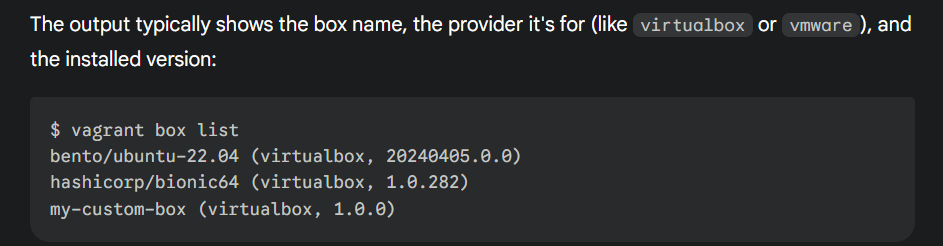
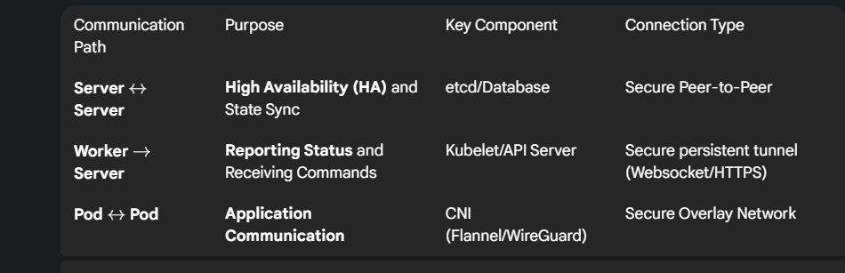

## What is Vagrant, and what are the other  similar tools in the market
A tool to create VM. It can works both on windows and Linux machines. The similar product on the 

we can install vagrant on winodwss too. Amd64  is for 64 bit OS like Windows 11. 

Control pnel, turn windows features on or off means  customizing the windows programs  for you. 

## First basic commands.  
vagrant comands works in the Pwershell or cmd once they  vagrant is installed on the windows.  
-vagrant init <boxname> will add the image to vagrantfile. 
vagrant up will create the virtual machine itself. 


#Vagrant file is in Ruby language.
while ansible uses jinja2 template for variable expansion, docker-compose use a yaml file and uses docker variable substition, 
vagrant is a Ruby script, hence it has its own keywords, functions, 

vagrand ssh <machineName> will try to make an ssh connection. 
in the project it isrequired to be with no pasword. This is done through RSA key setuo. 

#### Host vs Vagrand Vm ?


## Vagrant file: the Basic elements:
There is no such thing as preconfigured vm box. There are more simple boxex and more prepared boxes like Kali Linux.  4

-

### iso file  vs box file
Remember your first vm box createion effort with VBox application. Then comes manual or graphical installation where you choose a language, user, hostname and paswords and partitioned disk. 

-RAM, Storage, CPU these elements can be add to the box later. 
-You have to select a iso file. then A box is a started completed, configured  
-Language is kind of OS version dependent. some allow  change of language later. 
-One can cretae his own box and then create his own reusable box via "vagrant package" to create a box file.  Later  "vagrant box add" and later be references as "config.vm.bkx ="my-custom-box".  Created boxes are stored in the main host  under "~/.vagrand.d/boxes" for Linux and MAcOS.
-by nature any iso file is mostly only readeable to everybody, unless you want to make it to yours r--r--r--. While,  a box file is mutable, so the owner has write permission, like rw_--- ---. 

### OS image vs Kernel version

-OS image is the general OS like Windows 11 or Ubuntu 22.04 or Debian 12 or Centos Linux8
Whereas the Kernel Version is the internal build number (major, minor, ...). for windows  it is typically like 
[Version 10.0.26100.6725]
which correspond to maor/minor buildn no (26100) and version (6725)


after tuesday or monthy   updates, foe windows only the version wnumber might change. for major chnages (roughly once a year) the build number w
ill change. 

# k3s vs k8s vs k3d // kubectl kubeadm kubelet
k8s is the large scale  kubernetse , k3s is for restricted resources. 

#kubeadm, kubectl, kubelet
 all three serves different distinc roles. 
 kubectl is like the cli tool for the kubernetes, it is in the local machine .

 Kubeadm reside in control plane (alos on the nodes during the join) 

 kubelet is the system dameon where it resides on nodes (both contraol pane and worker nodes ). it ihas no comands. 

 In a typical Laptop as the local or admin  machine, the serverA as the control plane and the serverB as the worker node,  kubectl is typically installed on both local machine and control plane, optioanlay on the worker node. 
 The kubeadm is installed both on the  control plane (ServerA ) and the worker node (ServerB) . On the Control plane it init it. on the worker node it will join (register )  worker  to the control plane. 
 The kubelet  is also intalled both on contral plane and worker node that each worker node register itsel  with to control palen and  containers are run .  
 ## kubectl vs k3s
 -k3s is a kind of bundle for kubeadm +kubelet+containerd. İt is not an alternative to the kubectl. so one need to install kubectl to manage the cluster. while k3s run the cluster, kubectl manage the cluster. 

 -kubectl is installed on the local machine like laptop ,desktop or jump host, where you run vagrant from  and you manage cluster from.  If you go install kubectl on the any node, you risk to manage cluster from the the inside, which will be mixing management and run concerns. 

 * - the k3s already inclue kubectl , which we dont have to install seperately. 


 ### Kubeconfig file
 the workflow of  kubeconfig is like this:  with the installation of the k3s , the config file is created on the server. This file is copied to the local machine. and kubectl use this file. 

 this file is located on the Contral plane at the /etc/ranchek3s/k3s.yml.
 this file need to be shared or coppied to the local machine where kubectl is installed. From the exampless I explored, Art. coppies to the shared folder on the Control plane via cp.  Dam creates the kubeconfig but do not explicitly coppy it. the other make it accessible to  everyone via 'chmod 777' on the file on the control Node. 

The kubeconfig  file contains cluster API endpoin with the port. 
CA certificate, 
Client certificate and key for authentication
Context information. 


# Rancher labs develop  k3s 

#provider is teh VM creating sorftware, provisioner is the toold the setup like a sheşş script, an ansible, a pubper.    

# P1 : Preparation and installations
-We are supposed to work from a virtual machine as the campus workstations are not allowed to install everything. 

-we are required to create two machines: myLoginS  to serve as contral plane, and the second machıne myLoginSW, the worker server  to serve as the worker node. 
-These machines need to appointed Private IP from same subnet.  this is for the purpose to 

## SSH connection to nodes
In the project, we are supposed to be able to make ssh connections with no password , that is to say we need to put the public key in these servers for a more secure connection.  

AS you know we need to put a ras.pub key in the remote or target so that there is paswordless sshh connection.  this is the manual way of doing this. 

However, vagrant handle this automatically , even there is a special comand like "vagrant ssh <usuer@ip>". In this regard, vagrant tool is combining some elements of the ansible. 

Basically there are three options.: 
a) the default behaviour of vagrant is to put a reandom public key in each  VM/node and perform the  and perform the connection.

b) telling vagrant to use the same key for acn VM/node.
'config.ssh.insert_key = false' inside the first nest  will keep the same key for all VMs.

c) telling vagrant to use your own public key  by privding the the key path to it. 

' config.ssh.private_key_path = "~/.ssh/id_rsa" ' inside the first nest will enfors vagrant to put your public key inside the each VM/node. 


-we are supposed to install K3s on these both machines. k3s is not an direct alternative to kubeadm or kubelet. it is an all-in-one  solcution taht bundles kubeadm, kubelet, containerd, and other dependencies in a simplied installer.  

we need to install 

## Network : Container Network Interface (CNI) 
 ### flannel choice
flannel is an easy lightway netowk that k3s implements. the flaneld is the daemon that make it. 

### eth1

### Authentication between nodes
 Yes nodes need to autehnticate between each other, otherwise any machine could join the cluster.

Authentication is first done during the join, by worker nodes. 


## Scripts and preparations
 ### 1-Token Management
 Tokens are needed for initial authentication. later the certificates will be exchanged.   Hoewer sometimes the pre-shared certicates can be used (like Artam's appraoch, He ues a yaml file and mention certificates there). 
 Sometimes Token can be put in to .env files , or be hardcoded .

 ### 2- OS & Provisioning

The choice of OS image is free. it is indicated in the first nest.  I guess if we have prefered to have different distribution or OS in the same cluster we had to mention it

Provisioning means shels and scripts for installation and preparations. The provision can be handled in the vagrantfile as inline shell. Or, external scripts.

### 3. Security & System Configurations

Why they have opted for these security setup? how net-tools provide security and system configurations?

### 4-File Sharing  & Setup
 config.vm.synced_folder <HOST_PATH>, <GUEST_PATH> are the parameters for the shared folder. It shares the host folder with the guest fo lder, where the guest is the vm to be created.  The shared or sync is by default enabled. but the " field can be implemented to make it disabled. 

 ### 5- Installation approach
 what do you mean by installation approach?

 ### 6-Other features
 -use alias k kubectl to call kubectl. I guess i do on control node because  it is the shared folder? 

### 7-ports, firewalds
I guess the operations sysrems at the beginning are ready to listen from a service. By installing a firewald like ufw or firewald  we put a network tool to mangae it. 
CentOs comes with firewald daemon.  

For simplicty, we disable firewald. 

### install net-tools
we install nettools for leagacy network tools like ifconfig, netstat, route, which are suefull for debugging network issues. 

### security
temporaary close of security aboth for control and worker node can make things easier for the development, lab environment.  these are:

sudo systemctl disable firewalld --now
sudo setenforce 0
sed -i 's/SELINUX=.*/SELINUX=disabled/g' /etc/selinux/config
sudo ufw disable

### API port 6443 , kill any previous process attached to this port

# P1 Scripts on the machines
## Control Scirpt 
* -creation of a token with the help of time stemp
* -installeion of the k3s (get it from the repo, set its env.var INSTALL_K3S_EXEC , and execute the script)
 
 ### - copyin (creation) and preaparation of the config file 
  
-as the /vagrant/ folder is the shared and synced folder between  master node and the host (laptop Winows), copy (cp) the rancher's k3s.yml file  to a file which will be created  newly. All these operations happens in the master node. But  as the vagrant folder is synced, it measn we have the same file on the host, Windows laptop. 

-make the config file  rw to the owner, and only readable to non-owners.
-in the config file, change the loopback address to the intended IP address. 

### - adding an allias  as k="kubectl"  to the master profile
add a line to create alias for kubectl in the .bashrc file which is located in the vagrant folder of master node.
 echo 'alias k="kubectl" ' >> /home/vagrant/.bashrc 

* as the windows laptop, host, has its own .bashrc or its equivalnet file for windows , it wont recognize this alias on the host. If you want to make work this alias on the host as well, you need to modify your ownd profile file as well. 

### -Exporting  KUBECONFIG Environment variable in the master profile
```bash
echo 'export KUBECONFIG=/etc/rancher/k3s/k3s.yaml' >> /home/vagrant/.bashrc
```

The variable KUBECONFIG is defined in the kubectl. so this variable need to be assigned the correct value.  Either it can be passed as rhe rough argument to the kubectl command like "kubectl --kubeconfig /etc/rancher/k3s//k3s.yml (or /vagrant/k3s-congi as we created with cp), 
Or we can define as  "KUBECONFIG =/etc/rancher/k3s/k3s.yml" (maybe we had better use our newly created file /vagrant/k3s-congf file)

finally, if we do not worry about this each terminal, we had better  put this into  .bashrc file. 

as the bonus information, if you try t osue kubectl with sudo it will fail.as the sudo will use its own  profile (.bashrc file). you should either  use 
"kubectl get nodes" or 
"sudo /usr/local/bin/k3s kubectl get nodes"  or 


* in Summy, the master scritp help install k3s and do some configuratiıns to run kubectl. 


## Agent or Worker script

*-we should pass the IP of master node, 
-the Token is the one which is created on the master side. 
-Similar to master node we get the k3s executabel. But the argument passed to the script are a bit different. this can be done via the INSTAL_K3s_EXEC environment variable too.

 


## first Running:
### from the local 

 - best practixe is to enter the masternode and uhandle the cluster or check the cluster from there.  But the local (windows laptop too) can install kubectl  and the related KUBECONFIG file to  handle or monitor the cluster. 
 
### Entering master node
We have to enter the master node to see the situatioon. we 
to access the control panel  vagrant ssh master-node


## Suspending & Stopping temporarly & Removing 
from the local (windows laptop) 
vagrant halt  will stop all VMs preserving the states. We can resume later via up.
for a permanent removel  "vagrant destroy -f"

the command "vagrant up" basicly do two functionalties. if the VM boxes are not created it will create them. if the boxes are stopped (halt ror powered off) it will  starts teh Vm.  if boxes are already runnign, "vagrant up" could  re-run provisioning depending on the configurations or flags???

*if vagrantfile is modified, "vagrant reload" is better. 


 
# P2 Project requirements and Learning Sucets
 
 ## A -Projrvy Requirements: 
 ### 1- Only one virtual machine
 -basic of k3s means the kubernets.
 All three applications will be accessible via onle one IP address

 ### 2- control plane + worker node together. 
 -one VM inhich k3s is installed as server mode: This meaeans there no control plane and vowrke node seperation.  one process will do wo work all two: control plane( API Server, scheduler, contoller manager)  + etcd  datastore( SQLite ro K3s is teh default), + kubelt/containerd that runs the pods are all running together inside one K3s process .

 ### 3 - Three web application

 It seems the subject ask us to create thre web application simpl for the sake of leearning  deployeng three different  deplomners in the same environment/server  with the help of  K3s.  these applications could have a common task to do, but for this project it is not the case. if it were the case that they are ding a common job, the containers will communicate each other via  ,nternal DNS addrss. 

 only one IP addrss will serve three wep application with the help of ingress controller. 

 ### 4- APP2 HAS TO HAVE 3 REPLİCAS

 ### 5- Ingress bases resolution 
 İngress helğs to serve the choice based on the browser request. 


## B -Proejct Manifest and their explainations .

Vagrant file and  hardware and provisionings:   centos8 image  that will use a private network, hafrom a shared folder ,  to will run a script for provisoning. 

 ### script for provisioning the VM
 we are going to have only one VM. for the school campuse it will be a VM inside a VM. 

 disable fireasdls,  ad msilence Selinux. check  other preoceses that use 6443 port.  install  k3s 
 -

## B0- Preparation of the Box, Vagrantfile. 

 ## B1- Deployents
 all three uses port 8080, bas they will not conflict. 
 handle security issue to avoid problems. 
 get k3s and execute it. 

  ### first idents:
  apiVersion
  kind
  metadata
  spec:
### second ident spec:
replicas
selector
template


### B2 - Ingreses
one file with 3 rules that use prefix pathType. 
the port is 80

## B3-Services
three services  the define protocol type target and  port (source port)

### C Project Run
vagrant up : 

# P3

## Project Requirement


