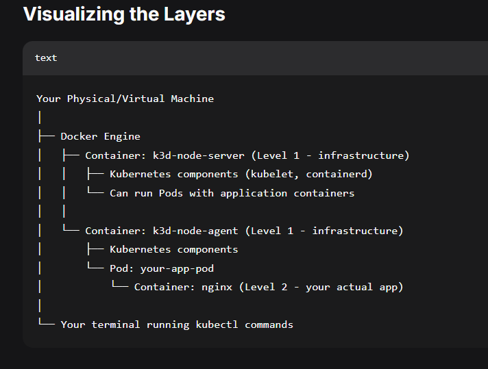

# Inception of Things 

## A short summary

 Cratiıng kubernetes wia K3s where we can host various applications in different replicas via a single Domain.  Vagrant is used to create virtual boxes.

 if you are curious about K3s, kubectl, kubeadm, kubelet, joining two computers, os file vs box file,  ..
  Read my long stuy notes below for the project.


## What is Vagrant, and what are the other  similar tools in the market
Vagrant is a tool to create VM. It can works both on windows and Linux machines. The similar product on the market is terraform, 

we can install vagrant on winodwss too. Amd64  is for 64 bit OS like Windows 11. 

For w'ndows dont forget to turn windows features on or off in the " Control panel" menu, which means  customizing the windows programs. 

## First basic commands for Vagrant.  
vagrant comands works in the Pwershell or cmd once the  vagrant is installed on the windows.  Normally "vagrant init <boxname> will add the image to vagrantfile and "vagrant up" will create the virtual machine from the prefered virtualization platform like Virtual Box.  


Cagrant is a tool, therefore it has many capabilities with which it comes. For example,  it will handle ssh key generation and placsing in necessary location both for the client (where vagrant is installed and working) to the targets (where they are being created).  For example "vagrant ssh <machineName> will try to make an ssh connection. As in the project it isrequired that ssh  be with no pasword, this is the exactly this pattern, no need to wory about ssh keys externally. 

<vagrant box list> will list  vms and the privder (like virtualbox or vmware) as well as their versions. like 


<vagrant destroy> will destroy and delete the resources related to the instance, <vagrant box remove mySpecificbıx> remove the template, box.
so after vagrant destroy we can invoke vagrant box remove myBox, but not vice versa.

vagrant status will show the machines  states, whether they are running or not. 


#### Host vs Vagrand Vm ?


## Vagrantfile: the basic elements:
 Vagrant file is in  Ruby language. Hence vagrant is a Ruby script, hence it has its own keywords, functions, variable expansion. Recall that ansible uses jinja2 template for variable expansion, docker-compose use a yaml file and uses docker variable substition.


### iso file  vs box file
Remember your first vm box createion effort with VBox application.In the manual or graphical installation, you choose a language, user, hostname and paswords and partitioned disk. 

-RAM, Storage, CPU these elements can be added to the box later. 
-You have to select a iso file. then a box is  started completed, configured  
-Language choice like English or French is a bit OS dependent. Some  versions allow  change of language later. For some OS, ,t ,s hard to change later. 
-One can cretae his own box and then create his own reusable box via "vagrant package" to create a box file.  Later  "vagrant box add" and later be references as "config.vm.bkx ="my-custom-box".  Created boxes are stored in the main host  under "~/.vagrand.d/boxes" for Linux and MAcOS.
-by nature any iso file is mostly only readeable to everybody, unless you want to make it to yours r--r--r--. While,  a box file is mutable, so the owner has write permission, like rw_--- ---.

There is no such thing as preconfigured vm box. There are more simple boxex and more prepared boxes like Kali Linux.  


### OS image vs Kernel version

-OS image is the general OS like Windows 11 or Ubuntu 22.04 or Debian 12 or Centos Linux8
Whereas the Kernel Version is the internal build number (major, minor, ...). for windows  it is typically like 
[Version 10.0.26100.6725]
which correspond to major/minor buildin no (26100) and version (6725)


after tuesday or monthly   updates, foe windows only the version wnumber might change. for major chnages (roughly once a year) the build number will change. 

# k3s vs k8s vs k3d // kubectl kubeadm kubelet
While k8s is the large scale  kubernetse , k3s is for restricted resources. 

## Token generation and share
Toekn can be generated in various way. 

We create a token which takes the first 6 digits of the timestamps which will not change in a year. We also impose a check if token exists ti wont re-create the token. Infact, this wont bother, as the newly created token is put int hte shared folder so that the worker node will also use the node. 

## Installation of k3s
 ### installetion script:
 https://get.k3s.io site is a comprhensive script.sh file. There is an example to  populate the INSTAL?K3S_EXEC variable. 

-for cmd in kubectl, crictl ctr,, do something. 
-no reference to kubeadm. 
no reference to join command

-k3s.yml file is only put in shared foldr on server and s"sed -i"  in the server node. 

### INSTAL_K3S_EXEC variable 
This is the variable in the script to be downloaded from the k3s.io site.  The variable is populated and the scriptis executed via  "sh" command.  the hyphen after sh is not mandatory but ensure the command will execute the argument frım stdin.

### k3s-config file (former /etc/rancher/k3s/k3s.yaml ) KUBECONFIG file
in the k3s context, we get the script on  https://get.k3s.io/
we populate the variable INSTALL_K3S_EXEC  .
 and we run this script. Probably there are many sub shell /processes being executed. 
 
a file is creat at "/etc/rancher/k3s/k3s.yaml"  which execution have created this file?

so the file is what is generally known as KUBECONFIG file that is being created  dynamically ( reflecting the current environmn variables) 


However, on the agent side, there is no such files like /etc/rancher/k3s/k3sbeing created.  


## Joining two computer

In kubernets architecure there is joining of nodes. However for k3s the join function is done via  k3s installation automatically. 
It may the first time you have heard of the term "joining two computeters". Indeed  with K3s we join two computrs  in a subordinate relationship. The one who acept based on the token is the Serer or Master, or Control panel,  while the one that is provided with token to authenticate itself to the Master node. 

REcall that the containerization  was a kind of nested or recursive comuters, while joining computers means  creation a subordinate relationship between compıters. If you like analogies like me, it is like the  conductor and the musician in a concert. the  musician can join if he has the token of concuctor .


 ## Scalling out and High Availability (HA)
  one can increase the number of worker nodes  as well incrase the master nodes. incrasing the number of workers measn adding muscle to the  cluster wihc it implies it can handle more operations.  this is called scalling out .But one can increase the master nodes toos. This si for redundancy or resilience purpose. This is called high Availabilirty (HA). 

  * Do each Contol plane adn worker nodes communicate and see each other among themselves?
  Yes. Indeed this is the core of this  kubernetes concept. 

  MAster <--> Master:
  Both Master nodes join each other as the initial mutual authentication. They are connected to each other to agree on the state (which replica is the one to register the data....) This is called peer-to-peer connection and is mainly concerning the "disributed databases" like etcd or external databases like PosgresSQL.  
  -They see each other via 

  Server->Worker :
  Woerker node use the API token to join the cluster.  
  The conncection is don via kubelt   via using HTTPS/TLS  to the Control panel (API Server). Worker  communicate to  Server to present its health status. Server talk to Worker to  tell which pod should run stop or manage. 
  Server and Worker see each toher via API Server.


  Pods<-->pods : or inter aplications:
  This kind of the heart of the topic. The network overla( CNI-Container Network Interface- Flannel)  help conncetion and visiblity.  This connection is also made to the master nodes. 

  A table of sumary:
  


## kubeadm, kubectl, kubelet
 all three serves different distinc roles. 
 kubectl is like the cli tool for the kubernetes, it is in the local machine as well as the control plane.

 Kubeadm reside in control plane (alos on the nodes during the join) 

 kubelet is the system dameon where it resides on nodes (both contraol pane and worker nodes ). it ihas no comands in cli.

 In a typical Laptop as the local or admin  machine, the serverA as the control plane and the serverB as the worker node,  kubectl is typically installed on both local machine and control plane, optioanlay on the worker node. 
 The kubeadm is installed both on the  control plane (ServerA ) and the worker node (ServerB) . On the Control plane it init it. on the worker node it will join (register )  worker  to the control plane. 
 The kubelet  is also intalled both on contral plane and worker node that each worker node register itsel  with to control palen and  containers are run .  


 ## kubectl vs k3s
 -k3s is a kind of bundle for kubeadm +kubelet+containerd. İt is not an alternative to the kubectl. so one need to install kubectl to manage the cluster. while k3s run the cluster, kubectl manage the cluster. 

 -kubectl is installed on the local machine like laptop ,desktop or jump host, where you run vagrant from  and you manage cluster from.  If you go install kubectl on the any node, you risk to manage cluster from the the inside, which will be mixing management and run concerns. 

 * - the k3s already inclue kubectl , which we dont have to install seperately. 


 ### Kubeconfig file
 the workflow of  kubeconfig is like this:  with the installation of the k3s , the config file is created on the server. This file is copied to the local machine. and kubectl use this file. 

 this file is located on the Contral plane at the /etc/ranchek3s/k3s.yml.
 this file need to be shared or coppied to the local machine where kubectl is installed. From the exampless I explored, Art. coppies to the shared folder on the Control plane via cp.  Dam creates the kubeconfig but do not explicitly coppy it. the other make it accessible to  everyone via 'chmod 777' on the file on the control Node. 

The kubeconfig  file contains cluster API endpoin with the port. 
CA certificate, 
Client certificate and key for authentication
Context information. 


# Rancher labs develop  k3s 

 ## VM craetions in vagrant.

provider is teh VM creating sorftware ( like virtualbox or vmware).  

Provisioner is the script the VM is going to  be created having this.   depending on the provisioner type we can guess what kind of actions are done. shell provisioner means somme command or scripts are executed.  A A file prowisioner  means there is coopy prcess. Ansible provisioner means some playbooks are going to be executed. 

#### define & hostname & prvovider.name & user

defin intoruces the node identifier. "vagrant up myNode". if the node is not  passed here it wil create tall nodes .

hostname is for the user name in the guest OS. it is important for networking purpıses. 

provider.name is the  name of the VM to be seen on the provider (virtualbox).

user/login:
generally it is the "vagrant". If one change the  username, the ssh cofnigurations need to be done accordingly. 


# P1 :

## Preparation and installations
-We are supposed to work from a virtual machine as the campus workstations are not allowed to install everything. 

-we are required to create two machines: myLoginS  to serve as contral plane, and the second machıne myLoginSW, the worker server  to serve as the worker node. 
-These machines need to appointed Private IP from same subnet.  this is for the purpose to 

## SSH connection to nodes
In the project, we are supposed to be able to make ssh connections with no password , that is to say we need to put the public key in these servers for a more secure connection.  

AS you know we need to put a ras.pub key in the remote or target so that there is paswordless sshh connection.  this is the manual way of doing this. 

However, vagrant handle this automatically , even there is a special comand like "vagrant ssh <usuer@ip>". In this regard, vagrant tool is combining some elements of the ansible. 

Basically there are three options.: 
a) the default behaviour of vagrant is to put a reandom public key in each  VM/node and perform the  and perform the connection.

b) telling vagrant to use the same key for acn VM/node.
'config.ssh.insert_key = false' inside the first nest  will keep the same key for all VMs.

c) telling vagrant to use your own public key  by privding the the key path to it. 

' config.ssh.private_key_path = "~/.ssh/id_rsa" ' inside the first nest will enfors vagrant to put your public key inside the each VM/node. 


-we are supposed to install K3s on these both machines. k3s is not an direct alternative to kubeadm or kubelet. it is an all-in-one  solcution taht bundles kubeadm, kubelet, containerd, and other dependencies in a simplied installer.  

we need to install 

## Network : Container Network Interface (CNI) 
 ### flannel choice
flannel is an easy lightway netowk that k3s implements. the flaneld is the daemon that make it. 

### eth1

### Authentication between nodes
 Yes nodes need to autehnticate between each other, otherwise any machine could join the cluster.

Authentication is first done during the join, by worker nodes. 


## Scripts and preparations
 ### 1-Token Management
 Tokens are needed for initial authentication. later the certificates will be exchanged.   Hoewer sometimes the pre-shared certicates can be used (like Artam's appraoch, He ues a yaml file and mention certificates there). 
 Sometimes Token can be put in to .env files , or be hardcoded .

 we are going to 

 ### 2- OS & Provisioning

The choice of OS image is free. it is indicated in the first nest.  I guess if we have prefered to have different distribution or OS in the same cluster we had to mention it

Provisioning means shels and scripts for installation and preparations. The provision can be handled in the vagrantfile as inline shell. Or, external scripts.

### 3. Security & System Configurations

Why they have opted for these security setup? how net-tools provide security and system configurations?

### 4-File Sharing  & Setup
 config.vm.synced_folder <HOST_PATH>, <GUEST_PATH> are the parameters for the shared folder. It shares the host folder with the guest fo lder, where the guest is the vm to be created.  The shared or sync is by default enabled. but the " field can be implemented to make it disabled. 

 ### 5- Installation approach
 what do you mean by installation approach?

 ### 6-Other features
 -use alias k kubectl to call kubectl. I guess i do on control node because  it is the shared folder? 

### 7-ports, firewalds
I guess the operations sysrems at the beginning are ready to listen from a service. By installing a firewald like ufw or firewald  we put a network tool to mangae it. 
CentOs comes with firewald daemon.  

For simplicty, we disable firewald. 

### install net-tools
we install nettools for leagacy network tools like ifconfig, netstat, route, which are suefull for debugging network issues. 

### security
temporaary close of security aboth for control and worker node can make things easier for the development, lab environment.  these are:

sudo systemctl disable firewalld --now
sudo setenforce 0
sed -i 's/SELINUX=.*/SELINUX=disabled/g' /etc/selinux/config
sudo ufw disable

### API port 6443 , kill any previous process attached to this port

# P1 Scripts on the machines
## Control Scirpt 
* -creation of a token with the help of time stemp
* -installeion of the k3s (get it from the repo, set its env.var INSTALL_K3S_EXEC , and execute the script)
 
 ### - copyin (creation) and preaparation of the config file 
  
-as the /vagrant/ folder is the shared and synced folder between  master node and the host (laptop Winows), copy (cp) the rancher's k3s.yml file  to a file which will be created  newly. All these operations happens in the master node. But  as the vagrant folder is synced, it measn we have the same file on the host, Windows laptop. 

-make the config file  rw to the owner, and only readable to non-owners.
-in the config file, change the loopback address to the intended IP address. 

### - adding an allias  as k="kubectl"  to the master profile
add a line to create alias for kubectl in the .bashrc file which is located in the vagrant folder of master node.
 echo 'alias k="kubectl" ' >> /home/vagrant/.bashrc 

* as the windows laptop, host, has its own .bashrc or its equivalnet file for windows , it wont recognize this alias on the host. If you want to make work this alias on the host as well, you need to modify your ownd profile file as well. 

### -Exporting  KUBECONFIG Environment variable in the master profile
```bash
echo 'export KUBECONFIG=/etc/rancher/k3s/k3s.yaml' >> /home/vagrant/.bashrc
```

The variable KUBECONFIG is defined in the kubectl. so this variable need to be assigned the correct value.  Either it can be passed as rhe rough argument to the kubectl command like "kubectl --kubeconfig /etc/rancher/k3s//k3s.yml (or /vagrant/k3s-congi as we created with cp), 
Or we can define as  "KUBECONFIG =/etc/rancher/k3s/k3s.yml" (maybe we had better use our newly created file /vagrant/k3s-congf file)

finally, if we do not worry about this each terminal, we had better  put this into  .bashrc file. 

as the bonus information, if you try t osue kubectl with sudo it will fail.as the sudo will use its own  profile (.bashrc file). you should either  use 
"kubectl get nodes" or 
"sudo /usr/local/bin/k3s kubectl get nodes"  or 


* in Summy, the master scritp help install k3s and do some configuratiıns to run kubectl. 


## Agent or Worker script

*-we should pass the IP of master node, 
-the Token is the one which is created on the master side. 
-Similar to master node we get the k3s executabel. But the argument passed to the script are a bit different. this can be done via the INSTAL_K3s_EXEC environment variable too.

 


## first Running:
### from the local 

 - best practixe is to enter the masternode and uhandle the cluster or check the cluster from there.  But the local (windows laptop too) can install kubectl  and the related KUBECONFIG file to  handle or monitor the cluster. 
 
### Entering master node
We have to enter the master node to see the situatioon. we 
to access the control panel  vagrant ssh master-node


## Suspending & Stopping temporarly & Removing 
from the local (windows laptop) 
vagrant halt  will stop all VMs preserving the states. We can resume later via up.
for a permanent removel  "vagrant destroy -f"

the command "vagrant up" basicly do two functionalties. if the VM boxes are not created it will create them. if the boxes are stopped (halt ror powered off) it will  starts teh Vm.  if boxes are already runnign, "vagrant up" could  re-run provisioning depending on the configurations or flags???

*if vagrantfile is modified, "vagrant reload" is better. 

 ##### fodler strucutre on the  control node
 file folder structure in both machine. kubectl is on the both  machine but config exist only on the  Controla panel, hence it can show  nodes, or pods (currently no pods).


 
# P2
 in p2 projects, the goal is to create the cluster on a single machine, to deploy 3 different application with different replica sets. Ingress will do the routing. 

## Project requirements and Learning Sucets

 ## A -Project Requirements:

 ### 1- Only one virtual machine
 -basic of k3s means the kubernets. This  means no token generation, hence tno need to pass token to the INSTAL?K3S_EXEC variable .
 All three applications will be accessible via onle one IP address

 ### 2- control plane + worker node together. 
 -one VM inhich k3s is installed as server mode: This meaeans there no control plane and vowrke node seperation.  one process will do wo work all two: control plane( API Server, scheduler, contoller manager)  + etcd  datastore( SQLite ro K3s is teh default), + kubelt/containerd that runs the pods are all running together inside one K3s process .

 ### 3 - Three web application

 It seems the subject ask us to create thre web applications simpl for the sake of leearning  deployeng three different  deplomners in the same environment/server  with the help of  K3s.  these applications could have a common task to do, but for this project it is not the case. if it were the case that they are ding a common job, the containers will communicate each other via  ,nternal DNS addrss. 

 only one IP addrss will serve three wep application with the help of ingress controller. 


 ### 4- APP2 HAS TO HAVE 3 REPLİCAS

 ### 5- Ingress bases resolution 
 İngress helps to serve the choice based on the browser request. 


## B -Proejct Manifest and their explainations .

Vagrant file and  hardware and provisionings:   centos9s image  that will use a private network, hafrom a shared folder ,  to will run a script for provisoning. 

 ### script for provisioning the VM
 we are going to have only one VM. for the school campuse it will be a VM inside a VM. 

 disable fireasdls,  ad msilence Selinux. check  other preoceses that use 6443 port.  install  k3s 
 -

## B0- Preparation of the Box, Vagrantfile. 

 ## B1- Deployments
 all three uses port 8080, bas they will not conflict. 
 handle security issue to avoid problems. 
 get k3s and execute it. 

  ### first idents:
  apiVersion
  kind
  metadata
  spec:
### second ident spec:
replicas
selector
template


### B2 - Ingreses
one file with 3 rules that use prefix pathType. 
the port is 80


## B3-Services
three services  the define protocol type target and  port (source port)

### C Project Run
vagrant up : 
one VM will be created that will run server.sh to install k3s and  and created  pods, services and the ingress. 

### Testing the applications. 
-for Windows modify etc/hosts to  be ble to match the IP to the applicaiton  via 
notepad C:\Windows\System32\drivers\etc\hosts

on the modenr browsers like chrome,  http://IP version , which will show the app3.com is working. for the testing http://app1.com it always redirect to the https versison, whch is an publicirty address on the go dady. 

-vagrant ssh will enter you to the cluster.  from here 
curl 'http://192.168.56.110/' -H 'Host: app1.com'   w,ll bring the result. 

#### Difference between LoadBalanceer and Ingress
Ingress is a layer 7 application and uses protocols like HTTP, while LoadBalancer is a L3  and uses TCP protocols. 

### Port-wise analyssi. 

container <> pod <> service <> ingress
service is cluster level and need to contain two ports one to  communicate to pos/containers the other is tits own  port for external or ingress. 
ingress define on port to communicate with service, but it will  listen from outside direcly via controller. 

There is no port speficiation for pod. it will inherit tge saem network namespace from container. if there are mulitple contianer in a single pod, they will shre it. 


## P2 Extensions & Limitations
AS it is difficult to block redirection on modern brosers like Chrome or Firefox, pe can define apps' host name as app1x1.com iinstead of app1.com where browser find a redirection and gooes tho that site. 

currently  App1 is the nginxdemo/hello:plain-text image where it display  server addrss, name, as well as the request ID.  app2: hashicorps/hppt-echo:latest image and app3 :  same httecho.  The text to display is modified. 

How to overcome Brovser https redirection? 

# P3

## Project Requirements

Containerize tek3s--> k3d && CD with ARgo CD.


### K3S vs. K3D

K3S: Lightweight Kubernetes distribution.

K3D: Runs K3S clusters inside Docker containers for simplicity and speed. 
How can conteinerizde   k3s are simplier and faster? 
  ##### Problem of architecture arm64 vs amd64 ? 
  we are using VirtualBox which host a debian VM which install K3d.... Do we still have to wory about windows compatibility for k3d or k3s ?

  

### No need for vagrant, manual VM
because  vagrant is resource consuming, because k3s will create containers? 

Why there are no ingress.yml file? 
because  there is only one application, we simply do the port-forwarding. 

### Argo CD
a server: 
is argo CD a cli tool or a web application?
both. 

a server that has both cli and  web interface. 

 ArgoCd  is a server an run my VM,  it has a Web gui as well. its job is to sync between external source and the internal  artefacts. But I cant communicate back to repo , this will be against the security. 

### Github Actions/Gitlab CI && Argo CD

they serve different purposes. while Github Actions and GitlabCI create artefacts and test tgem, Argo CD   deeploy to the cluster. 


#### Deployment and Service files on the Repo. 
 Deployment files need tto contain replicas infor and spec.dontainers. information which refer to image (located on the Dockerhub) and containerPort.

 as expected this file is supposed to be on the github repo that can serve as single source of truth.

 Service file is the one that will define the namespace and selector so that it will match to the deployment.  

Replica SEt --> Deployment --> Pod
Actually you can crate a pod with a pod manifest.  But you cant modify the replica set info and as it miss a Deployment file, when the pod is died, kubernetes wont re create it as ther is no deplymnet. 

Service is only good to have a stable DNS and IP.

##### ports revised.
The ports infos for  containers is not necessary to be defined in Deployments. it is just for bisual easiness.  The service side can define the container part, which is the targetPort section. 


for service: the ports field can have multiple sub fields . the port is the  

 #### Application 
 it is the Custom Resource Definition defined in the  large raw file.  The large file on the argocD project repo plus our specific file will configure the argocd server(sercive) that it will control the pods in the cluser.  

 think of argocd server as the  one that is constantl runnign "kubectl apply -f )

 the service part is 

 Kubernetes and Cluster are not same thing:
 kubernetes and cluster are not necessarly the same. kubernetes is part of the cluster.  then who creates cluster? the concept of cluster is not that hard defined. if there are tow nodes and you install k3s on both of them with some configurations they form a cluster (P1).  you can install k3s in a single VM that will create various pods, still the notion of cluster is there.  

Kluster  is differernt than kubernetes.  kubernetes is the kubectl that allow to see or monitor or control pods.  so we can add extra things like argo cd into kluster, hence Argo CD is part of the cluster but not part of the kubernetes.


as the K3d is the containerizded  cluster, şt adds another layer , this help understand better. 


##### node pod container. 
while node is more similar to a physicial computer machine,  pod is more abstract concept for containers.  when tehrere  3 replicas, 3 pods are created which are containers individually. 

pods are logical host for containers. each pod has its own network namespace (same IP, can talk via localhost). in an advanced case scenario, a pod can host multi containers. then they can talk via localhost. 

In K3d case, there are actually two layer of Docker. the one that emulate (mimic)  physical machines, nodes, and an inner container that run a specific applicaiton (the business logic). 





Question: so here cluster is created in the container right? Why we here use k3d? why we need to create nodes inside the docker (1st level)? generally speaking, a container is a kind of minimalist computer. if we create a container inside this container it becomes what? 

 ##### Servide 


# Bonus
 ## Project Requiremenets: 
